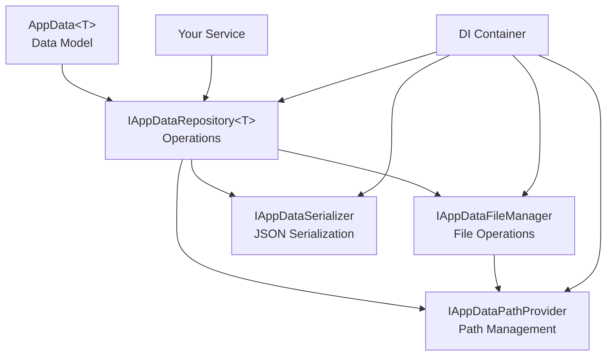

# AppData

[](https://www.nuget.org/packages/ktsu.AppData/)
[](https://github.com/ktsu-dev/AppData/actions)
[](https://opensource.org/licenses/MIT)

A modern, SOLID-compliant application data storage library for .NET that provides type-safe persistence with full dependency injection support.

## ✨ Features

- **🏗️ SOLID Architecture**: Clean separation of concerns with dependency injection
- **🎯 Type Safety**: Strongly-typed paths using `ktsu.Semantics`
- **🔧 Dependency Injection**: Full DI support with standard .NET patterns
- **🧪 Testable**: Easy mocking and isolated unit testing
- **📁 Backup & Recovery**: Automatic backup and corruption recovery
- **⚡ Performance**: Debounced saves and efficient file operations
- **🔒 Thread Safe**: Safe for concurrent access
- **📦 Zero Dependencies**: Minimal external dependencies

## 🚀 Quick Start

### Installation

```bash
dotnet add package ktsu.AppData
```

### Basic Usage

1. **Configure services** (Program.cs):
```csharp
using ktsu.AppData.Configuration;

var services = new ServiceCollection();
services.AddAppData();
services.AddTransient<IMyService, MyService>();

using var serviceProvider = services.BuildServiceProvider();
```

2. **Create your data model**:
```csharp
using ktsu.AppData;

public class UserSettings : AppData<UserSettings>
{
    public string Theme { get; set; } = "Light";
    public string Language { get; set; } = "English";
    public Dictionary<string, string> Preferences { get; set; } = new();
}
```

3. **Use in your services**:
```csharp
using ktsu.AppData.Interfaces;

public class MyService
{
    private readonly IAppDataRepository<UserSettings> _repository;
    
    public MyService(IAppDataRepository<UserSettings> repository)
    {
        _repository = repository;
    }
    
    public void SaveUserPreferences(string theme, string language)
    {
        var settings = new UserSettings
        {
            Theme = theme,
            Language = language
        };
        
        settings.Save(_repository);
    }
    
    public UserSettings LoadUserPreferences()
    {
        return _repository.LoadOrCreate();
    }
}
```

## 📖 Usage Examples

### ASP.NET Core Integration

```csharp
// Program.cs
var builder = WebApplication.CreateBuilder(args);

// Add AppData services
builder.Services.AddAppData(options =>
{
    // Custom JSON options
    options.JsonSerializerOptions = new JsonSerializerOptions
    {
        WriteIndented = true,
        PropertyNamingPolicy = JsonNamingPolicy.CamelCase
    };
});

// Add your services
builder.Services.AddScoped<IUserService, UserService>();

var app = builder.Build();
```

### Custom File Locations

```csharp
public class DatabaseConfig : AppData<DatabaseConfig>
{
    public string ConnectionString { get; set; } = "";
    public int TimeoutSeconds { get; set; } = 30;
    
    // Save to custom subdirectory
    protected override RelativeDirectoryPath? Subdirectory => 
        "database".As<RelativeDirectoryPath>();
    
    // Use custom filename
    protected override FileName? FileNameOverride => 
        "db_config.json".As<FileName>();
}
```

### Queued Saves with Debouncing

```csharp
public class RealTimeService
{
    private readonly IAppDataRepository<AppState> _repository;
    private readonly AppState _state = new();
    
    public RealTimeService(IAppDataRepository<AppState> repository)
    {
        _repository = repository;
    }
    
    public void UpdateState(string key, string value)
    {
        _state.Data[key] = value;
        _state.QueueSave(); // Queues save, doesn't write immediately
    }
    
    public async Task FlushChanges()
    {
        _state.SaveIfRequired(_repository); // Only saves if debounce time elapsed
    }
}
```

## 🧪 Testing

The library provides excellent testing support with mock file systems:

```csharp
[Test]
public async Task UserService_SavesSettings_Successfully()
{
    // Arrange
    var services = new ServiceCollection();
    services.AddAppDataForTesting(() => new MockFileSystem());
    services.AddTransient<IUserService, UserService>();
    
    using var serviceProvider = services.BuildServiceProvider();
    var userService = serviceProvider.GetRequiredService<IUserService>();
    
    // Act
    userService.SaveUserPreferences("Dark", "Spanish");
    
    // Assert
    var settings = userService.LoadUserPreferences();
    Assert.AreEqual("Dark", settings.Theme);
    Assert.AreEqual("Spanish", settings.Language);
}
```

## ⚙️ Configuration Options

### Default Configuration
```csharp
services.AddAppData();
```

### Custom Serialization
```csharp
services.AddAppData(options =>
{
    options.JsonSerializerOptions = new JsonSerializerOptions
    {
        WriteIndented = false,
        PropertyNamingPolicy = JsonNamingPolicy.CamelCase,
        DefaultIgnoreCondition = JsonIgnoreCondition.WhenWritingNull
    };
});
```

### Custom File System
```csharp
services.AddAppData(options =>
{
    options.FileSystemFactory = _ => new MyCustomFileSystem();
});
```

### Replace Components
```csharp
services.AddAppData();

// Replace with custom implementations
services.Replace(ServiceDescriptor.Singleton<IAppDataSerializer, XmlSerializer>());
services.Replace(ServiceDescriptor.Singleton<IAppDataPathProvider, CustomPathProvider>());
```

## 🏗️ Architecture

The library follows SOLID principles with a clean, dependency-injection-based architecture:



### Core Interfaces

- **`IAppDataRepository<T>`**: High-level data operations (Load, Save)
- **`IAppDataFileManager`**: File I/O with backup/recovery
- **`IAppDataSerializer`**: Data serialization (JSON by default)
- **`IAppDataPathProvider`**: Type-safe path management

## 📁 File Storage

Data is stored in the user's application data directory:

```
Windows: %APPDATA%\{ApplicationName}\
macOS:   ~/Library/Application Support/{ApplicationName}/
Linux:   ~/.config/{ApplicationName}/
```

Files are saved with automatic backup and recovery:
- **Primary file**: `user_settings.json`
- **Backup file**: `user_settings.json.bk` (temporary during writes)
- **Recovery**: Automatic restoration from backup if primary file is corrupted

## 🔄 Migration Guide

### From Version 1.x (Static API)

**Old (v1.x)**:
```csharp
public class Settings : AppData<Settings>
{
    public string Theme { get; set; }
}

// Static usage
var settings = Settings.Get();
settings.Theme = "Dark";
settings.Save();
```

**New (v2.x)**:
```csharp
public class Settings : AppData<Settings>
{
    public string Theme { get; set; }
}

// Dependency injection
public class MyService
{
    private readonly IAppDataRepository<Settings> _repository;
    
    public MyService(IAppDataRepository<Settings> repository)
    {
        _repository = repository;
    }
    
    public void UpdateTheme(string theme)
    {
        var settings = _repository.LoadOrCreate();
        settings.Theme = theme;
        settings.Save(_repository);
    }
}
```

## 🎯 Best Practices

### 1. Use Dependency Injection
Always inject `IAppDataRepository<T>` rather than using static methods:

✅ **Good**:
```csharp
public MyService(IAppDataRepository<Settings> repository)
{
    _repository = repository;
}
```

❌ **Avoid**:
```csharp
var repository = AppData.GetRepository<Settings>(); // Static access
```

### 2. Handle Disposal Properly
Save queued changes before disposal:

```csharp
using var settings = new Settings();
settings.QueueSave();
settings.SaveIfRequired(repository); // Save before disposal
```

### 3. Use Custom Paths Appropriately
Override paths for logical grouping:

```csharp
public class DatabaseSettings : AppData<DatabaseSettings>
{
    protected override RelativeDirectoryPath? Subdirectory => 
        "database".As<RelativeDirectoryPath>();
}

public class UiSettings : AppData<UiSettings>
{
    protected override RelativeDirectoryPath? Subdirectory => 
        "ui".As<RelativeDirectoryPath>();
}
```

### 4. Test with Mock File Systems
Always use `AddAppDataForTesting()` in unit tests:

```csharp
services.AddAppDataForTesting(() => new MockFileSystem());
```

## 🤝 Contributing

Contributions are welcome! Please feel free to submit a Pull Request. For major changes, please open an issue first to discuss what you would like to change.

## 📄 License

This project is licensed under the MIT License - see the [LICENSE.md](LICENSE.md) file for details.

## 🔗 Related Packages

- [`ktsu.Semantics`](https://github.com/ktsu-dev/Semantics) - Type-safe semantic types
- [`ktsu.CaseConverter`](https://github.com/ktsu-dev/CaseConverter) - String case conversion utilities
- [`ktsu.ToStringJsonConverter`](https://github.com/ktsu-dev/ToStringJsonConverter) - Custom JSON converters
