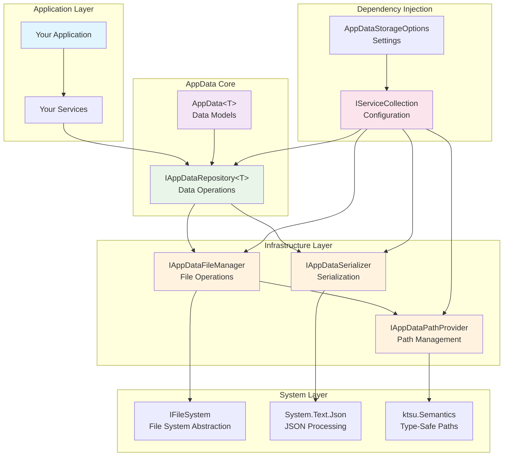
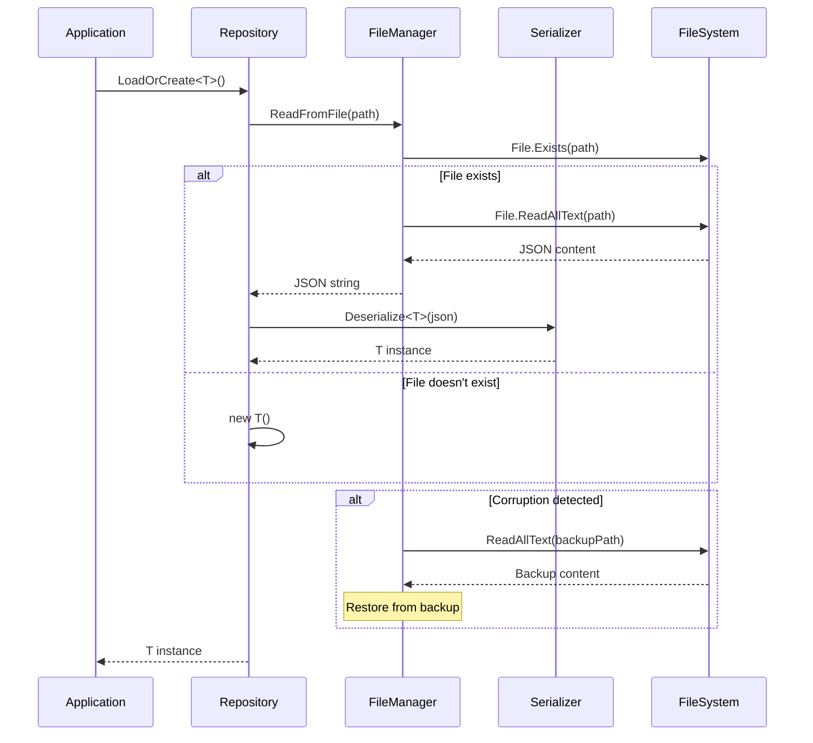
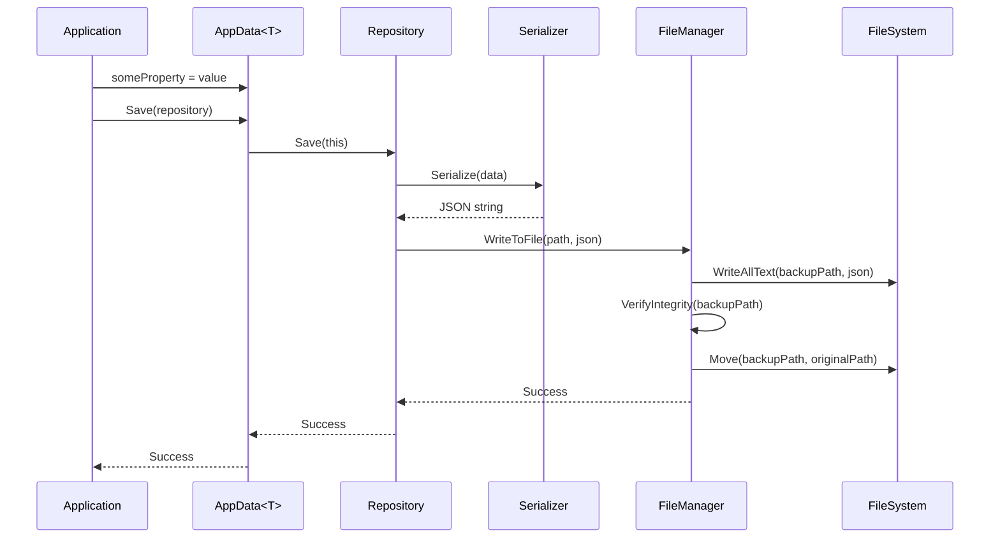

# AppData Architecture Documentation

This document provides a comprehensive overview of the AppData library's architecture, design principles, and implementation details.

## 📐 Design Principles

The AppData library has been architected following **SOLID principles** and modern .NET dependency injection patterns to provide a clean, testable, and maintainable solution for application data persistence.

### SOLID Compliance

#### Single Responsibility Principle (SRP)
Each class has a single, well-defined responsibility:
- `IAppDataSerializer` → Data serialization/deserialization only
- `IAppDataFileManager` → File operations and backup management only
- `IAppDataPathProvider` → Path generation and validation only
- `IAppDataRepository<T>` → Orchestrates high-level data operations only

#### Open/Closed Principle (OCP)
The architecture is open for extension but closed for modification:
- New serialization formats can be added by implementing `IAppDataSerializer`
- Custom file systems can be integrated via `IFileSystem` 
- Path strategies can be customized through `IAppDataPathProvider`
- Business logic extensions happen through repository composition

#### Liskov Substitution Principle (LSP)
All implementations are fully substitutable:
- Any `IAppDataSerializer` implementation works with any repository
- Any `IFileSystem` implementation works with the file manager
- Mock implementations behave identically to production implementations

#### Interface Segregation Principle (ISP)
Clients depend only on interfaces they use:
- Serialization clients don't depend on file operations
- File operation clients don't depend on path generation
- Path clients don't depend on serialization
- Each interface is focused and minimal

#### Dependency Inversion Principle (DIP)
High-level modules depend on abstractions, not concretions:
- `AppDataRepository<T>` depends on `IAppDataFileManager` interface, not concrete implementation
- `DefaultAppDataFileManager` depends on `IFileSystem` interface, not `System.IO`
- All dependencies are injected, no `new` operators in business logic

### DRY (Don't Repeat Yourself)
- Generic `AppDataRepository<T>` eliminates repetition across data types
- Base `AppData<T>` class provides common functionality
- Shared configuration through `AppDataStorageOptions`
- Reusable service registration extensions

## 🏗️ Component Architecture



## 🔧 Core Components

### 1. Data Model Layer (`AppData<T>`)

**Purpose**: Base class for all application data models
**Responsibilities**:
- Provides common data model functionality
- Defines file path and naming conventions
- Implements save operations with repository injection
- Manages save queuing and debouncing

**Key Features**:
```csharp
public abstract class AppData<T> : IDisposable where T : AppData<T>, new()
{
    // Path customization
    protected virtual RelativeDirectoryPath? Subdirectory => null;
    protected virtual FileName? FileNameOverride => null;
    
    // Save operations
    public void Save(IAppDataRepository<T> repository);
    public void QueueSave();
    public void SaveIfRequired(IAppDataRepository<T> repository);
    
    // Debouncing mechanism
    private DateTime? lastQueueTime;
    private static readonly TimeSpan SaveDebounceTime = TimeSpan.FromMilliseconds(100);
}
```

### 2. Repository Layer (`IAppDataRepository<T>`)

**Purpose**: High-level data operations coordinator
**Responsibilities**:
- Orchestrates load/save operations
- Coordinates between file manager and serializer
- Provides clean API for data operations
- Handles error management and recovery

**Implementation Pattern**:
```csharp
public class AppDataRepository<T> : IAppDataRepository<T> where T : AppData<T>, new()
{
    private readonly IAppDataFileManager fileManager;
    private readonly IAppDataSerializer serializer;
    
    public T LoadOrCreate()
    {
        try
        {
            var json = fileManager.ReadFromFile(GetFilePath());
            return json != null ? serializer.Deserialize<T>(json) : new T();
        }
        catch
        {
            return new T(); // Graceful degradation
        }
    }
    
    public void Save(T data)
    {
        var json = serializer.Serialize(data);
        fileManager.WriteToFile(GetFilePath(), json);
    }
}
```

### 3. File Management Layer (`IAppDataFileManager`)

**Purpose**: Safe file operations with backup and recovery
**Responsibilities**:
- Atomic file writes with backup protection
- Corruption detection and recovery
- File system abstraction management
- Error handling and logging

**Backup Strategy**:
```
1. Write content to temporary backup file (.bk extension)
2. Verify backup file integrity
3. Atomically replace original file with backup
4. Clean up temporary files
5. On corruption: restore from backup automatically
```

**Implementation Details**:
```csharp
public void WriteToFile(AbsoluteFilePath filePath, string content)
{
    var backupPath = GetBackupPath(filePath);
    
    try
    {
        // Step 1: Write to backup file first
        fileSystem.File.WriteAllText(backupPath.ToString(), content);
        
        // Step 2: Verify backup integrity
        if (!VerifyFileIntegrity(backupPath))
            throw new InvalidOperationException("Backup verification failed");
        
        // Step 3: Atomic replace
        fileSystem.File.Move(backupPath.ToString(), filePath.ToString());
    }
    catch
    {
        // Cleanup on failure
        if (fileSystem.File.Exists(backupPath.ToString()))
            fileSystem.File.Delete(backupPath.ToString());
        throw;
    }
}
```

### 4. Serialization Layer (`IAppDataSerializer`)

**Purpose**: Data serialization and deserialization
**Responsibilities**:
- JSON serialization with custom options
- Type safety and validation
- Custom converter support
- Error handling for malformed data

**Default Configuration**:
```csharp
private static readonly JsonSerializerOptions DefaultOptions = new()
{
    WriteIndented = true,
    PropertyNamingPolicy = JsonNamingPolicy.CamelCase,
    ReferenceHandler = ReferenceHandler.Preserve,
    Converters = {
        new JsonStringEnumConverter(),
        new ToStringJsonConverter()
    }
};
```

### 5. Path Management Layer (`IAppDataPathProvider`)

**Purpose**: Type-safe path generation and management
**Responsibilities**:
- Generate platform-appropriate storage paths
- Handle subdirectory organization
- Provide type-safe path operations using `ktsu.Semantics`
- Support custom file naming conventions

**Path Resolution Logic**:
- **Base Directory**: Platform-specific app data directory
- **Application Folder**: Based on entry assembly name
- **Subdirectories**: Optional logical grouping (e.g., "settings", "cache")
- **File Names**: Type-based or custom override

```csharp
public AbsoluteFilePath GetFilePath<T>() where T : AppData<T>, new()
{
    var baseDir = GetApplicationDataDirectory();
    var subdirectory = GetSubdirectory<T>();
    var fileName = GetFileName<T>();
    
    return baseDir
        .Combine(subdirectory ?? "".As<RelativeDirectoryPath>())
        .Combine(fileName);
}
```

## 🔄 Data Flow Patterns

### 1. Load Operation Flow


### 2. Save Operation Flow


## 🧪 Testing Architecture

The library provides comprehensive testing support through dependency injection and abstraction layers.

### Testing Components

#### Mock File System Integration
```csharp
services.AddAppDataStorageForTesting(() => new MockFileSystem());
```

#### In-Memory Testing
```csharp
public class TestAppDataFileManager : IAppDataFileManager
{
    private readonly Dictionary<string, string> files = new();
    
    public string? ReadFromFile(AbsoluteFilePath filePath)
        => files.TryGetValue(filePath.ToString(), out var content) ? content : null;
    
    public void WriteToFile(AbsoluteFilePath filePath, string content)
        => files[filePath.ToString()] = content;
}
```

#### Test Doubles and Stubs
All interfaces support easy mocking:
```csharp
var mockSerializer = new Mock<IAppDataSerializer>();
var mockFileManager = new Mock<IAppDataFileManager>();
var mockPathProvider = new Mock<IAppDataPathProvider>();

var repository = new AppDataRepository<TestData>(
    mockFileManager.Object,
    mockSerializer.Object,
    mockPathProvider.Object
);
```

## ⚙️ Configuration Architecture

### Service Registration Pattern
```csharp
public static class AppDataServiceCollectionExtensions
{
    public static IServiceCollection AddAppDataStorage(
        this IServiceCollection services,
        Action<AppDataStorageOptions>? configureOptions = null)
    {
        // Configure options
        services.Configure(configureOptions ?? (_ => { }));
        
        // Register core services
        services.AddSingleton<IAppDataPathProvider, DefaultAppDataPathProvider>();
        services.AddSingleton<IAppDataSerializer, JsonAppDataSerializer>();
        services.AddSingleton<IAppDataFileManager, DefaultAppDataFileManager>();
        
        // Register file system
        services.AddSingleton<IFileSystem>(_ => new FileSystem());
        
        // Register repository as scoped for thread safety
        services.AddScoped(typeof(IAppDataRepository<>), typeof(AppDataRepository<>));
        
        return services;
    }
}
```

### Options Pattern Implementation
```csharp
public class AppDataStorageOptions
{
    public JsonSerializerOptions JsonSerializerOptions { get; set; } = DefaultJsonOptions;
    public Func<IServiceProvider, IFileSystem>? FileSystemFactory { get; set; }
    public TimeSpan SaveDebounceTime { get; set; } = TimeSpan.FromMilliseconds(100);
}
```

## 🔒 Thread Safety

### Repository Lifetime Management
- **Repositories**: Scoped lifetime for thread isolation
- **File Operations**: Thread-safe through atomic writes
- **Serialization**: Stateless and thread-safe
- **Path Operations**: Immutable and thread-safe

### Concurrent Access Patterns
```csharp
// Safe: Each request gets its own repository instance
public class UserService
{
    private readonly IAppDataRepository<UserSettings> repository;
    
    public UserService(IAppDataRepository<UserSettings> repository)
    {
        this.repository = repository; // Scoped per request/operation
    }
}
```

## 🚀 Performance Characteristics

### Optimization Strategies

1. **Debounced Saves**: Prevents excessive file I/O
2. **Lazy Loading**: Data loaded only when requested
3. **Atomic Operations**: Minimal lock contention
4. **Stream-based Serialization**: Reduced memory allocation
5. **Path Caching**: Computed paths cached per type

### Memory Management
- **Minimal Allocations**: Reuse of serialization buffers
- **Disposal Pattern**: Proper cleanup of resources
- **Weak References**: For cached instances where appropriate

## 🔧 Extension Points

### Custom Serialization
```csharp
public class XmlAppDataSerializer : IAppDataSerializer
{
    public T Deserialize<T>(string data) where T : new()
    {
        // Custom XML deserialization
    }
    
    public string Serialize<T>(T data)
    {
        // Custom XML serialization
    }
}

// Registration
services.Replace(ServiceDescriptor.Singleton<IAppDataSerializer, XmlAppDataSerializer>());
```

### Custom Path Strategies
```csharp
public class DatabasePathProvider : IAppDataPathProvider
{
    public AbsoluteFilePath GetFilePath<T>() where T : AppData<T>, new()
    {
        // Store in database-specific directory structure
        return GetDatabaseDirectory().Combine($"{typeof(T).Name}.json".As<FileName>());
    }
}
```

### Custom File Operations
```csharp
public class EncryptedFileManager : IAppDataFileManager
{
    public void WriteToFile(AbsoluteFilePath filePath, string content)
    {
        var encrypted = Encrypt(content);
        // Write encrypted content
    }
    
    public string? ReadFromFile(AbsoluteFilePath filePath)
    {
        var encrypted = ReadEncrypted(filePath);
        return encrypted != null ? Decrypt(encrypted) : null;
    }
}
```

## 📋 Best Practices

### 1. Service Registration
- Always use `AddAppDataStorage()` in production
- Use `AddAppDataStorageForTesting()` in unit tests
- Configure options through the options pattern

### 2. Data Model Design
```csharp
public class AppSettings : AppData<AppSettings>
{
    // Use properties with default values
    public string Theme { get; set; } = "Light";
    public int MaxConnections { get; set; } = 10;
    
    // Override paths for organization
    protected override RelativeDirectoryPath? Subdirectory => 
        "settings".As<RelativeDirectoryPath>();
    
    // Use meaningful file names
    protected override FileName? FileNameOverride => 
        "app_settings.json".As<FileName>();
}
```

### 3. Repository Usage
```csharp
public class ConfigurationService
{
    private readonly IAppDataRepository<AppSettings> repository;
    
    public ConfigurationService(IAppDataRepository<AppSettings> repository)
    {
        this.repository = repository;
    }
    
    public void UpdateTheme(string theme)
    {
        var settings = repository.LoadOrCreate();
        settings.Theme = theme;
        settings.Save(repository); // Explicit repository injection
    }
}
```

### 4. Error Handling
```csharp
public class RobustDataService
{
    public T LoadWithFallback<T>() where T : AppData<T>, new()
    {
        try
        {
            return repository.LoadOrCreate();
        }
        catch (Exception ex)
        {
            logger.LogWarning(ex, "Failed to load {Type}, using defaults", typeof(T).Name);
            return new T(); // Graceful degradation
        }
    }
}
```

## 🔮 Future Architecture Considerations

### Planned Enhancements
1. **Async Operations**: Fully async file operations for better scalability
2. **Caching Layer**: Optional in-memory caching with invalidation
3. **Versioning Support**: Schema migration and version management
4. **Compression**: Optional compression for large data sets
5. **Cloud Storage**: Pluggable cloud storage providers

### Scalability Considerations
- **Horizontal Scaling**: Shared storage backends for multi-instance scenarios
- **Performance Monitoring**: Built-in metrics and health checks
- **Configuration Management**: Integration with .NET configuration system

This architecture provides a solid foundation for reliable, testable, and maintainable application data storage while remaining flexible enough for future enhancements and customizations.
